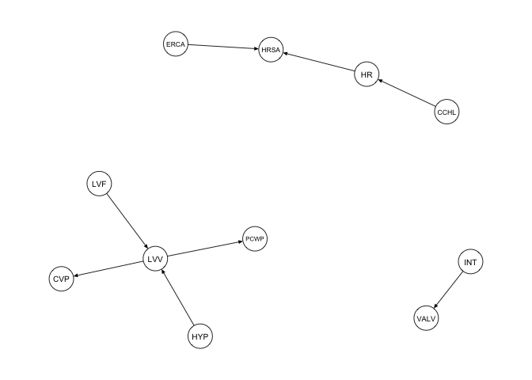
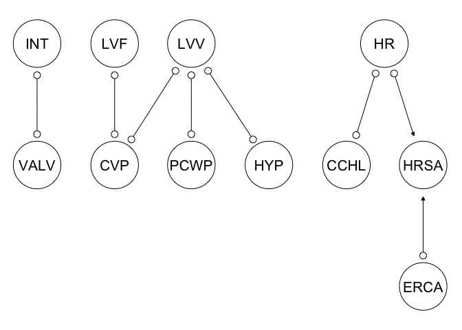
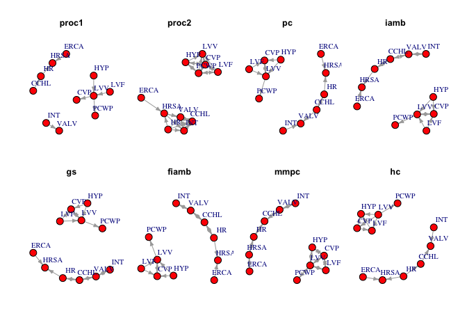
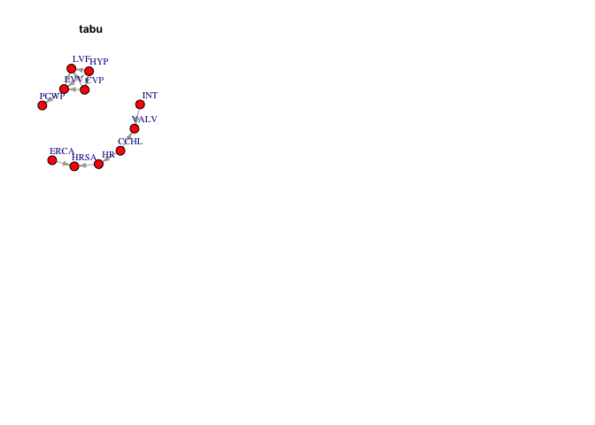

***Setup of the problem***

Given a large graph *G* = (*V*, *E*), where *V* represents the set of
nodes and *E* represents the set of edges, the goal is to select a
subgraph *S* = (*V**s*, *E**s*) from G such that S
is a meaningful and informative representation of the original graph
*G*. The subgraph selection problem involves finding an optimal or
near-optimal subgraph that satisfies certain criteria or objectives.

In the context of graphical modelling the problem of subgraph selection
corresponds to the problem of preserving the conditional independence
relationship in the subgraph *S* which has to be transferred from the
underlying graph *G*.

Furthermore, it is important to be able to evaluate the results of the
structure learning algorithms (learned on the data) taking as a ground
truth the selected subgraph.

    ### loading packages
    library("bnlearn")
    library("qgraph")
    library("igraph")
    library("pcalg")

Reading the files from Zenodo entry in the community

    # necessary libraries to use for Zenodo REST-API
    library(zen4R)

    zenodo <- ZenodoManager$new(
      logger = "INFO" # use "DEBUG" to see detailed API operation logs, use NULL if you don't want logs at all
    )

    # downloading files using zenodo doi and reading from the file 
    rec1 <- zenodo$getRecordByDOI("10.5281/zenodo.7676616")

    ## [zen4R][INFO] ZenodoRequest - Fetching https://zenodo.org/api/records?q=doi:%2210.5281/zenodo.7676616%22&size=10&page=1&allversions=1

    ## ℹ Successfully fetched list of published records - page 1

    ## [zen4R][INFO] ZenodoManager - Successfully fetched list of published records - page 1

    ## ✔ Successfully fetched list of published records!

    ## [zen4R][INFO] ZenodoManager - Successfully fetched list of published records!

    ## ✔ Successfully fetched record for DOI '10.5281/zenodo.7676616'!

    ## [zen4R][INFO] ZenodoManager - Successfully fetched record for DOI '10.5281/zenodo.7676616'!

    files <- rec1$listFiles(pretty = TRUE)

    #create a folder where to download files from record
    dir.create("download_zenodo")

    ## Warning in dir.create("download_zenodo"): 'download_zenodo' already exists

    #download files
    rec1$downloadFiles(path = "download_zenodo")

    ## ℹ Download in sequential mode

    ## [zen4R][INFO] ZenodoRecord - Download in sequential mode

    ## ℹ Will download 1 file from record '7676616' (doi: '10.5281/zenodo.7676616') - total size: 2 MiB

    ## [zen4R][INFO] ZenodoRecord - Will download 1 file from record '7676616' (doi: '10.5281/zenodo.7676616') - total size: 2 MiB

    ## ℹ Downloading file 'bnlearn_data.zip' - size: 2 MiB

    ## [zen4R][INFO] Downloading file 'bnlearn_data.zip' - size: 2 MiB

    ## ℹ File downloaded at '/Users/admin/Work/MaRDITA3/ntb_zenodo/StMaRDI/download_zenodo'.

    ## [zen4R][INFO] File downloaded at '/Users/admin/Work/MaRDITA3/ntb_zenodo/StMaRDI/download_zenodo'.

    ## ℹ Verifying file integrity...

    ## [zen4R][INFO] ZenodoRecord - Verifying file integrity...

    ## ℹ File 'bnlearn_data.zip': integrity verified (md5sum: f123ea701227cfd8a43996183b7c5279)

    ## [zen4R][INFO] File 'bnlearn_data.zip': integrity verified (md5sum: f123ea701227cfd8a43996183b7c5279)

    ## ✔ End of download

    ## [zen4R][INFO] ZenodoRecord - End of download

    downloaded_files <- list.files("download_zenodo")

    zipF = sprintf("download_zenodo/%s",downloaded_files)

    # unzipping in the current folder
    unzip(zipF,exdir = "./")

    alarm_name = list.files(tools::file_path_sans_ext(downloaded_files))[1]

    path_to_file = paste0(tools::file_path_sans_ext(downloaded_files),"/",alarm_name,"/",alarm_name,".csv")

    df = read.csv(path_to_file)
    head(df)

    ##      CVP   PCWP  HIST    TPR     BP     CO HRBP HREK HRSA    PAP   SAO2   FIO2   PRSS
    ## 1 NORMAL NORMAL FALSE    LOW NORMAL   HIGH HIGH HIGH HIGH NORMAL NORMAL    LOW   HIGH
    ## 2 NORMAL NORMAL FALSE NORMAL    LOW    LOW HIGH HIGH HIGH NORMAL    LOW NORMAL   HIGH
    ## 3 NORMAL   HIGH FALSE NORMAL NORMAL   HIGH HIGH HIGH HIGH NORMAL    LOW NORMAL NORMAL
    ## 4 NORMAL NORMAL FALSE    LOW    LOW   HIGH HIGH HIGH HIGH NORMAL NORMAL NORMAL   HIGH
    ## 5 NORMAL NORMAL FALSE    LOW    LOW NORMAL HIGH HIGH HIGH NORMAL    LOW NORMAL    LOW
    ## 6 NORMAL NORMAL FALSE    LOW NORMAL   HIGH HIGH HIGH HIGH NORMAL    LOW NORMAL   HIGH
    ##   ECO2 MINV    MVS   HYP   LVF   APL  ANES   PMB    INT  KINK  DISC    LVV   STKV CCHL
    ## 1 ZERO HIGH NORMAL FALSE FALSE FALSE FALSE FALSE NORMAL FALSE  TRUE NORMAL NORMAL HIGH
    ## 2 ZERO ZERO NORMAL FALSE FALSE FALSE FALSE FALSE NORMAL FALSE FALSE NORMAL    LOW HIGH
    ## 3 ZERO ZERO NORMAL FALSE FALSE FALSE FALSE FALSE NORMAL FALSE FALSE NORMAL NORMAL HIGH
    ## 4 ZERO ZERO NORMAL FALSE FALSE FALSE FALSE FALSE NORMAL FALSE FALSE NORMAL NORMAL HIGH
    ## 5 ZERO ZERO NORMAL FALSE FALSE FALSE FALSE FALSE NORMAL FALSE FALSE NORMAL NORMAL HIGH
    ## 6 HIGH ZERO NORMAL FALSE FALSE FALSE  TRUE FALSE NORMAL FALSE FALSE NORMAL NORMAL HIGH
    ##    ERLO   HR  ERCA   SHNT    PVS   ACO2 VALV VLNG VTUB   VMCH
    ## 1 FALSE HIGH FALSE NORMAL NORMAL NORMAL HIGH  LOW ZERO NORMAL
    ## 2 FALSE HIGH FALSE NORMAL    LOW    LOW ZERO ZERO  LOW NORMAL
    ## 3 FALSE HIGH FALSE NORMAL    LOW    LOW ZERO ZERO  LOW NORMAL
    ## 4 FALSE HIGH FALSE NORMAL NORMAL    LOW ZERO ZERO  LOW NORMAL
    ## 5 FALSE HIGH FALSE NORMAL    LOW    LOW ZERO ZERO  LOW NORMAL
    ## 6 FALSE HIGH FALSE NORMAL    LOW    LOW ZERO ZERO  LOW NORMAL

We need to transform data first

    for (item in colnames(df)){
      df[,item] = as.factor(df[,item])
    }

    data("alarm")
    alarm_df <- as.data.frame(na.omit(df))

    p = length(names(alarm))
    n = dim(alarm)[1]
    for (i in c(1:p)) {
      alarm_df[,i]<-as.numeric(alarm_df[,i])
    }

#### Applying nonparanormal transformation to standardize the data.

    library("huge")
    alarm_df <- huge.npn(alarm_df)

    ## Conducting the nonparanormal (npn) transformation via shrunkun ECDF....done.

    #####

Defining “true” graph as proposed for the ALARM dataset in bnlearn

    # "True" Graph ALARM
    dag_alarm = empty.graph(names(alarm))
    modelstring(dag_alarm) = paste0("[HIST|LVF][CVP|LVV][PCWP|LVV][HYP][LVV|HYP:LVF]",                    "[LVF][STKV|HYP:LVF][ERLO][HRBP|ERLO:HR][HREK|ERCA:HR][ERCA][HRSA|ERCA:HR]",
    "[ANES][APL][TPR|APL][ECO2|ACO2:VLNG][KINK][MINV|INT:VLNG][FIO2]",            "[PVS|FIO2:VALV][SAO2|PVS:SHNT][PAP|PMB][PMB][SHNT|INT:PMB][INT]",              "[PRSS|INT:KINK:VTUB][DISC][MVS][VMCH|MVS][VTUB|DISC:VMCH]",                    "[VLNG|INT:KINK:VTUB][VALV|INT:VLNG][ACO2|VALV][CCHL|ACO2:ANES:SAO2:TPR]",
    "[HR|CCHL][CO|HR:STKV][BP|CO:TPR]", sep = "")

    qgraph(dag_alarm, legend.cex = 0.3,
           asize=2,edge.color="black", vsize= 4)

Selection of the set of nodes for subsetting

    ### Subgraph 
    subgraph_nodes <- c("INT","VALV","LVF","LVV","PCWP","HR","CCHL","CVP","HYP","HRSA","ERCA")

**First** procedure (bnlearns subgraph function). It is implemented
through a simple subsetting of the edges which are adjacent to the
vertices contained in the subgraph\_nodes set.

    procedure1 <- bnlearn::subgraph(dag_alarm, subgraph_nodes)
    qgraph(procedure1, legend.cex = 0.3,
           asize=2,edge.color="black", vsize= 5)

**Second** procedure selects the subgraph based on the following
euristics. Given the ground truth DAG *G* = (*V*, *E*) and subset of
vertices *V**s* ⊂ *V* the goal is to find the corresponding
set of vertices *E**s* such that for
(*V**s*, *E**s*) the structure of the distribution
for $ P\_{V\_s}$ does not contradict the structure of the distribution
*P**V* so that we the task of structure estimation (and then
benchmarking) on (*V**s*, *E**s*) can be done with
a new ground truth.

Let *G* = (*V*, *E*) be the original directed acyclic graph, and
*P**V* is the joint distribution of random variables from
*V*.

We take two and check whether these vertices are *d*−connected given all
others in *V**s*. If they are not *d*-connected, there is no
association (no arrow in any direction). Otherwise, we have correlation
(with unknown direction). If one of the directions leads to the cycle in
the original graph, we resolve it and keep the other direction,
otherwise we keep both directions and then get the CPDAG.

**Third** procedure which сreats the PAG for the observable vertices in
the subset-graph with respect to the latent variables in the vertices
set *V* \\ *V*′.

PAG is the graph which is used to represent causal relationships in
situations where the exact underlying causal structure is not fully
known or observable. In our case we observe the variables in the set
*V*′. Based on the covariance matrix from the observed data
in *V*′ we generate.

    ######### Extract subgraph function

    combn(subgraph_nodes, 2)[2,1]

    ## [1] "VALV"

    dim(combn(subgraph_nodes,2))[2]

    ## [1] 55

    extract_subgraph <- function(dag, nodes){
      sg <- bnlearn::subgraph(dag,nodes) # procedure 1 (to be discussed)
      combinations <- combn(nodes,2) # all combinations of 2 distinct nodes in "nodes"
      n <- dim(combinations)[2]
      for (i in 1:n){
        observed <- nodes[nodes!=combinations[1,i] & nodes!=combinations[2,i]] # V'\{v,w}
        if (!is.element(combinations[1,i], nbr(sg, combinations[2,i])) & # check if there exists an edge already
            !bnlearn::dsep(dag,combinations[1,i],combinations[2,i])){ ### check if d-connected
          sg <- set.edge(sg, from = combinations[1,i], to = combinations[2,i]) ### undirected edge in case d-connected
        }
      }
      return(cpdag(sg)) ### to be discussed: return(cpdag(sg))
    }

    procedure2 <- extract_subgraph(dag_alarm, subgraph_nodes)
    qgraph(procedure2, legend.cex = 0.3,
           asize=2,edge.color="black", vsize= 5)

Subsetting the dataset according to “subgraph\_nodes” selection

    alarm_dfSubset <-as.data.frame(alarm_df[,subgraph_nodes])

    # procedure 3: forming the PAG from the observable and latent variables

    ## Step 1: Compute the true covariance matrix of the large graph G=(V,E).
    correlation_matrix = cor(alarm_df)

    #Step 2: subselect the observed variables and compute the  sub selected graph. 
    observed_vars = subgraph_nodes
    covMatrix_obs = correlation_matrix[observed_vars, observed_vars]

    # Step 3: Provide nececssary information for the algorithm to work on. 

    indepTest <- pcalg::gaussCItest
    suffStat <- list(C = covMatrix_obs, n = 1000)

    ## Step 4: Apply the FCI algorithm to the selected vertices

    # Use the FCI algorithm with the oracle correlation matrix
    normal.pag <- pcalg:: fci(suffStat, indepTest, alpha = 0.05, labels = observed_vars, verbose=TRUE)

    ## Compute Skeleton
    ## ================
    ## Order=0; remaining edges:110
    ## x= 1  y= 2  S=  : pval = 0.005042832 
    ## x= 1  y= 3  S=  : pval = 0.9641842 
    ## x= 1  y= 4  S=  : pval = 0.9723853 
    ## x= 1  y= 5  S=  : pval = 0.8775183 
    ## x= 1  y= 6  S=  : pval = 0.907297 
    ## x= 1  y= 7  S=  : pval = 0.9959888 
    ## x= 1  y= 8  S=  : pval = 0.9683535 
    ## x= 1  y= 9  S=  : pval = 0.9685349 
    ## x= 1  y= 10  S=  : pval = 0.8589276 
    ## x= 1  y= 11  S=  : pval = 0.9653777 
    ## x= 2  y= 1  S=  : pval = 0.005042832 
    ## x= 2  y= 3  S=  : pval = 0.9282327 
    ## x= 2  y= 4  S=  : pval = 0.7629024 
    ## x= 2  y= 5  S=  : pval = 0.7853056 
    ## x= 2  y= 6  S=  : pval = 0.08205837 
    ## x= 2  y= 7  S=  : pval = 0.03096158 
    ## x= 2  y= 8  S=  : pval = 0.6245208 
    ## x= 2  y= 9  S=  : pval = 0.6906646 
    ## x= 2  y= 10  S=  : pval = 0.4197323 
    ## x= 2  y= 11  S=  : pval = 0.8553025 
    ## x= 3  y= 4  S=  : pval = 6.13956e-10 
    ## x= 3  y= 5  S=  : pval = 3.094505e-08 
    ## x= 3  y= 6  S=  : pval = 0.9763708 
    ## x= 3  y= 7  S=  : pval = 0.8158414 
    ## x= 3  y= 8  S=  : pval = 2.009214e-12 
    ## x= 3  y= 9  S=  : pval = 0.8672087 
    ## x= 3  y= 10  S=  : pval = 0.9411474 
    ## x= 3  y= 11  S=  : pval = 0.9146438 
    ## x= 4  y= 3  S=  : pval = 6.13956e-10 
    ## x= 4  y= 5  S=  : pval = 0 
    ## x= 4  y= 6  S=  : pval = 0.9792193 
    ## x= 4  y= 7  S=  : pval = 0.9291572 
    ## x= 4  y= 8  S=  : pval = 2.726448e-225 
    ## x= 4  y= 9  S=  : pval = 4.528775e-213 
    ## x= 4  y= 10  S=  : pval = 0.9612071 
    ## x= 4  y= 11  S=  : pval = 0.9630885 
    ## x= 5  y= 3  S=  : pval = 3.094505e-08 
    ## x= 5  y= 4  S=  : pval = 0 
    ## x= 5  y= 6  S=  : pval = 0.9588945 
    ## x= 5  y= 7  S=  : pval = 0.8678652 
    ## x= 5  y= 8  S=  : pval = 4.026479e-171 
    ## x= 5  y= 9  S=  : pval = 3.497935e-165 
    ## x= 5  y= 10  S=  : pval = 0.9452638 
    ## x= 5  y= 11  S=  : pval = 0.9494562 
    ## x= 6  y= 7  S=  : pval = 1.246392e-251 
    ## x= 6  y= 8  S=  : pval = 0.9173549 
    ## x= 6  y= 9  S=  : pval = 0.9585462 
    ## x= 6  y= 10  S=  : pval = 7.873739e-103 
    ## x= 6  y= 11  S=  : pval = 0.9979575 
    ## x= 7  y= 2  S=  : pval = 0.03096158 
    ## x= 7  y= 6  S=  : pval = 1.246392e-251 
    ## x= 7  y= 8  S=  : pval = 0.993056 
    ## x= 7  y= 9  S=  : pval = 0.950604 
    ## x= 7  y= 10  S=  : pval = 7.565883e-58 
    ## x= 7  y= 11  S=  : pval = 0.8395238 
    ## x= 8  y= 3  S=  : pval = 2.009214e-12 
    ## x= 8  y= 4  S=  : pval = 2.726448e-225 
    ## x= 8  y= 5  S=  : pval = 4.026479e-171 
    ## x= 8  y= 9  S=  : pval = 1.342408e-84 
    ## x= 8  y= 10  S=  : pval = 0.8599433 
    ## x= 8  y= 11  S=  : pval = 0.7198062 
    ## x= 9  y= 4  S=  : pval = 4.528775e-213 
    ## x= 9  y= 5  S=  : pval = 3.497935e-165 
    ## x= 9  y= 8  S=  : pval = 1.342408e-84 
    ## x= 9  y= 10  S=  : pval = 0.8939413 
    ## x= 9  y= 11  S=  : pval = 0.8962443 
    ## x= 10  y= 6  S=  : pval = 7.873739e-103 
    ## x= 10  y= 7  S=  : pval = 7.565883e-58 
    ## |i= 100 |iMax= 110 
    ## x= 10  y= 11  S=  : pval = 1.755557e-93 
    ## x= 11  y= 10  S=  : pval = 1.755557e-93 
    ## Order=1; remaining edges:30
    ## x= 2  y= 1  S= 7 : pval = 0.00495715 
    ## x= 2  y= 7  S= 1 : pval = 0.03035172 
    ## x= 3  y= 4  S= 5 : pval = 0.005480407 
    ## x= 3  y= 4  S= 8 : pval = 0.2028018 
    ## x= 3  y= 5  S= 4 : pval = 0.6811937 
    ## x= 3  y= 8  S= 4 : pval = 0.0003707107 
    ## x= 3  y= 8  S= 5 : pval = 1.097774e-05 
    ## x= 4  y= 5  S= 3 : pval = 0 
    ## x= 4  y= 5  S= 8 : pval = 0 
    ## x= 4  y= 5  S= 9 : pval = 0 
    ## x= 4  y= 8  S= 3 : pval = 1.133435e-214 
    ## x= 4  y= 8  S= 5 : pval = 1.911786e-45 
    ## x= 4  y= 8  S= 9 : pval = 4.792264e-129 
    ## x= 4  y= 9  S= 3 : pval = 3.572456e-229 
    ## x= 4  y= 9  S= 5 : pval = 1.206858e-40 
    ## x= 4  y= 9  S= 8 : pval = 4.570084e-118 
    ## x= 5  y= 4  S= 3 : pval = 0 
    ## x= 5  y= 4  S= 8 : pval = 0 
    ## x= 5  y= 4  S= 9 : pval = 0 
    ## x= 5  y= 8  S= 3 : pval = 6.416106e-163 
    ## x= 5  y= 8  S= 4 : pval = 0.97089 
    ## x= 5  y= 9  S= 3 : pval = 6.32675e-174 
    ## x= 5  y= 9  S= 4 : pval = 0.7334259 
    ## x= 6  y= 7  S= 10 : pval = 3.03145e-181 
    ## x= 6  y= 10  S= 7 : pval = 2.498684e-43 
    ## x= 7  y= 2  S= 6 : pval = 0.2015305 
    ## x= 7  y= 6  S= 2 : pval = 1.718556e-250 
    ## x= 7  y= 6  S= 10 : pval = 3.03145e-181 
    ## x= 7  y= 10  S= 2 : pval = 1.192355e-57 
    ## x= 7  y= 10  S= 6 : pval = 0.9773594 
    ## x= 8  y= 3  S= 4 : pval = 0.0003707107 
    ## x= 8  y= 3  S= 5 : pval = 1.097774e-05 
    ## x= 8  y= 3  S= 9 : pval = 8.523627e-18 
    ## x= 8  y= 4  S= 3 : pval = 1.133435e-214 
    ## x= 8  y= 4  S= 5 : pval = 1.911786e-45 
    ## x= 8  y= 4  S= 9 : pval = 4.792264e-129 
    ## x= 8  y= 9  S= 3 : pval = 2.178566e-90 
    ## x= 8  y= 9  S= 4 : pval = 0.01885697 
    ## x= 8  y= 9  S= 5 : pval = 0.0007682433 
    ## x= 9  y= 4  S= 5 : pval = 1.206858e-40 
    ## x= 9  y= 4  S= 8 : pval = 4.570084e-118 
    ## x= 9  y= 8  S= 4 : pval = 0.01885697 
    ## x= 9  y= 8  S= 5 : pval = 0.0007682433 
    ## x= 10  y= 6  S= 7 : pval = 2.498684e-43 
    ## x= 10  y= 6  S= 11 : pval = 2.283733e-182 
    ## x= 10  y= 11  S= 6 : pval = 4.036619e-172 
    ## x= 10  y= 11  S= 7 : pval = 3.095705e-132 
    ## Order=2; remaining edges:18
    ## x= 4  y= 5  S= 8 9 : pval = 1.018631e-222 
    ## x= 4  y= 8  S= 5 9 : pval = 4.666987e-44 
    ## x= 4  y= 9  S= 5 8 : pval = 2.859149e-39 
    ## x= 8  y= 3  S= 4 9 : pval = 0.001962647 
    ## x= 8  y= 4  S= 3 9 : pval = 1.019198e-112 
    ## x= 8  y= 9  S= 3 4 : pval = 0.118346 
    ## 
    ## Compute PDSEP
    ## =============
    ## 
    ## Compute collider:
    ## 
    ##  6 *-> 10 <-* 11 
    ## 
    ##  11 *-> 10 <-* 6 
    ## 
    ## Possible D-Sep of 1 is: 2 
    ## 
    ## y =   2
    ## .........
    ## 
    ## Possible D-Sep of 2 is: 1 
    ## 
    ## y =   1
    ## .........
    ## 
    ## Possible D-Sep of 3 is: 8 
    ## 
    ## y =   8
    ## .........
    ## 
    ## Possible D-Sep of 4 is: 5 8 9 
    ## 
    ## y =   5
    ## .........
    ## 
    ## y =   8
    ## .........
    ## 
    ## y =   9
    ## .........
    ## 
    ## Possible D-Sep of 5 is: 4 
    ## 
    ## y =   4
    ## .........
    ## 
    ## Possible D-Sep of 6 is: 7 10 11 
    ## 
    ## y =   7
    ## .........
    ## ord =  1 
    ## ord =  2 
    ## 
    ## y =  10
    ## .........
    ## ord =  1 
    ## ord =  2 
    ## 
    ## Possible D-Sep of 7 is: 6 
    ## 
    ## y =   6
    ## .........
    ## 
    ## Possible D-Sep of 8 is: 3 4 
    ## 
    ## y =   3
    ## .........
    ## 
    ## y =   4
    ## .........
    ## 
    ## Possible D-Sep of 9 is: 4 
    ## 
    ## y =   4
    ## .........
    ## 
    ## Possible D-Sep of 10 is: 6 11 
    ## 
    ## y =   6
    ## .........
    ## 
    ## y =  11
    ## .........
    ## 
    ## Possible D-Sep of 11 is: 6 10 
    ## 
    ## y =  10
    ## .........
    ## ord =  1 
    ## 
    ## Direct edges:
    ## =============
    ## Using rules: 1 2 3 4 5 6 7 8 9 10 
    ## Compute collider:
    ## 
    ##  6 *-> 10 <-* 11 
    ## Sxz= and Szx=  
    ## 
    ##  11 *-> 10 <-* 6 
    ## Sxz=  and Szx=

    ## Step 5: Plot the resulting PAG (Partial Ancestral Graph)
    plot(normal.pag, 
         main = "Partial Ancestral Graph (PAG) for Subset of Nodes",
         vertex.label.cex = 0.8)

    ## Loading required namespace: Rgraphviz

    ## Warning in .local(x, y, ...): main title cannot *not* be set yet [Rgraphviz::plot()
    ## deficiency]

Applying constraint-based algorithms

    Res_stable=pc.stable(alarm_dfSubset)

    Res_iamb=iamb(alarm_dfSubset)

    Res_gs=gs(alarm_dfSubset)

    Res_fiamb=fast.iamb(alarm_dfSubset)

    Res_mmpc=mmpc(alarm_dfSubset)

Applying score-based algorithms

    Res_hc = hc(alarm_dfSubset)
    Res_tabu = tabu(alarm_dfSubset)

Visualize resulting subgraph in the images below:

    par(mfrow=c(2, 4), mar=c(1, 1, 1, 1), oma=c(2, 2, 2, 2))

    ig_proc1 <- as.igraph(procedure1)
    ig_proc2 <- as.igraph(procedure2)
    ig_pc <- as.igraph(Res_stable)
    ig_iamb <- as.igraph(Res_iamb)
    ig_gs <- as.igraph(Res_gs)
    ig_fiamb <- as.igraph(Res_fiamb)
    ig_mmpc <- as.igraph(Res_mmpc)

    ig_hc <- as.igraph(Res_hc)
    ig_tabu <- as.igraph(Res_tabu)

    plot(ig_proc1, main = "proc1", frame = T, layout=layout_with_fr, vertex.size=18,
         vertex.label.dist=4, vertex.color="red", edge.arrow.size=0.4, vertex.label.cex=1)
    plot(ig_proc2, main = "proc2", frame = T, layout=layout_with_fr, vertex.size=18,
         vertex.label.dist=4, vertex.color="red", edge.arrow.size=0.4, vertex.label.cex=1)
    plot(ig_pc, main = "pc", frame = T, layout=layout_with_fr, vertex.size=18,
         vertex.label.dist=4, vertex.color="red", edge.arrow.size=0.4, vertex.label.cex=1)
    plot(ig_iamb, main = "iamb", frame = T, layout=layout_with_fr, vertex.size=18,
         vertex.label.dist=4, vertex.color="red", edge.arrow.size=0.4, vertex.label.cex=1)
    plot(ig_gs, main = "gs", frame = T, layout=layout_with_fr, vertex.size=18,
         vertex.label.dist=4, vertex.color="red", edge.arrow.size=0.4, vertex.label.cex=1)
    plot(ig_fiamb, main = "fiamb", frame = T, layout=layout_with_fr, vertex.size=18,
         vertex.label.dist=4, vertex.color="red", edge.arrow.size=0.4, vertex.label.cex=1)
    plot(ig_mmpc, main = "mmpc", frame = T, layout=layout_with_fr, vertex.size=18,
         vertex.label.dist=4, vertex.color="red", edge.arrow.size=0.4, vertex.label.cex=1)
    plot(ig_hc, main = "hc", frame = T, layout=layout_with_fr, vertex.size=18,
         vertex.label.dist=4, vertex.color="red", edge.arrow.size=0.4, vertex.label.cex=1)
    plot(ig_tabu, main = "tabu", frame = T, layout=layout_with_fr, vertex.size=18,
         vertex.label.dist=4, vertex.color="red", edge.arrow.size=0.4, vertex.label.cex=1)

Selfdefined function for different measures

    measure = function(estim, true){
      result <- matrix(1,4)
      com <- bnlearn::compare(estim, true)
      shd <- bnlearn::shd(estim,true)
      result[1,] <- com$tp
      result[2,] <- com$fp
      result[3,] <- com$fn
      result[4,] <- shd
      rownames(result) <- c("true positives","false positives","false negatives","structural hamming distance")
      colnames(result) <- deparse(substitute(estim))
      return(result)
    }

Metric evaluation for procedure 1

    measure(Res_stable, procedure1)

    ##                             Res_stable
    ## true positives                       6
    ## false positives                      2
    ## false negatives                      5
    ## structural hamming distance          5

    measure(Res_iamb, procedure1)

    ##                             Res_iamb
    ## true positives                     5
    ## false positives                    3
    ## false negatives                    6
    ## structural hamming distance        4

    measure(Res_gs, procedure1)

    ##                             Res_gs
    ## true positives                   5
    ## false positives                  3
    ## false negatives                  6
    ## structural hamming distance      4

    measure(Res_fiamb, procedure1)

    ##                             Res_fiamb
    ## true positives                      5
    ## false positives                     3
    ## false negatives                     6
    ## structural hamming distance         4

    measure(Res_mmpc, procedure1)

    ##                             Res_mmpc
    ## true positives                     0
    ## false positives                    8
    ## false negatives                   11
    ## structural hamming distance        9

    measure(Res_hc, procedure1)

    ##                             Res_hc
    ## true positives                   5
    ## false positives                  3
    ## false negatives                  7
    ## structural hamming distance      9

    measure(Res_tabu, procedure1)

    ##                             Res_tabu
    ## true positives                     6
    ## false positives                    2
    ## false negatives                    6
    ## structural hamming distance        9

Metric evaluation for procedure 2

    measure(Res_stable, procedure2)

    ##                             Res_stable
    ## true positives                       4
    ## false positives                     16
    ## false negatives                      7
    ## structural hamming distance         16

    measure(Res_iamb, procedure2)

    ##                             Res_iamb
    ## true positives                     6
    ## false positives                   14
    ## false negatives                    5
    ## structural hamming distance       14

    measure(Res_gs, procedure2)

    ##                             Res_gs
    ## true positives                   6
    ## false positives                 14
    ## false negatives                  5
    ## structural hamming distance     14

    measure(Res_fiamb, procedure2)

    ##                             Res_fiamb
    ## true positives                      6
    ## false positives                    14
    ## false negatives                     5
    ## structural hamming distance        14

    measure(Res_mmpc, procedure2)

    ##                             Res_mmpc
    ## true positives                     4
    ## false positives                   16
    ## false negatives                    7
    ## structural hamming distance       16

    measure(Res_hc, procedure2)

    ##                             Res_hc
    ## true positives                   3
    ## false positives                 17
    ## false negatives                  9
    ## structural hamming distance     17

    measure(Res_tabu, procedure2)

    ##                             Res_tabu
    ## true positives                     4
    ## false positives                   16
    ## false negatives                    8
    ## structural hamming distance       17
